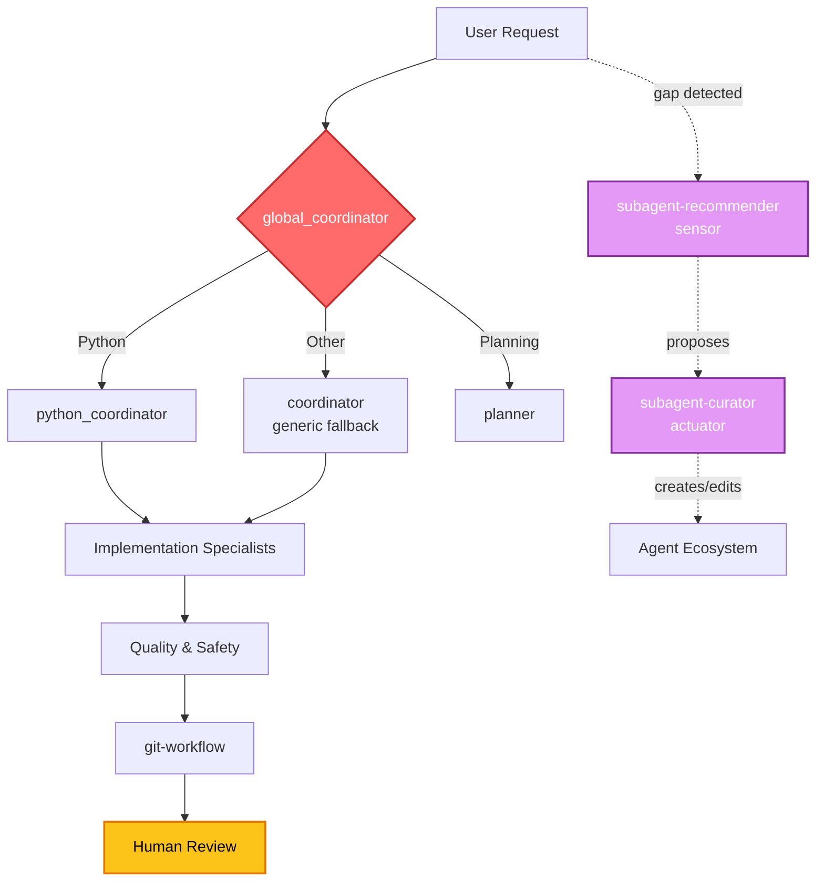

# Devin Desktop Automations - Agent Templates

A comprehensive collection of **generic agent templates and patterns** for Devin AI multi-agent systems. These templates provide a foundation for building specialized sub-agents while keeping project-specific knowledge private.

## Overview

This repository contains **generic agent templates, patterns, and documentation** that can be customized for any project. The templates are designed to be copied to your local Devin configuration and then adapted to your specific needs.

### Current Setup

**Moltra is currently using the setup in the `Current_setup_in_use_by Moltra/` folder.** This folder contains the active configuration and customizations being used in production.

## Architecture

The system uses a hierarchical delegation pattern where a coordinator agent orchestrates specialized sub-agents for specific tasks. The ecosystem is self-improving via a sensor/actuator loop.



See [agent-architecture.md](agent-architecture.md) for detailed diagrams (delegation flow, verification pipeline, improvement loop) and full agent/skill inventory.

### Available Templates

#### Coordinator
- **coordinator-template**: Main orchestrator for task delegation and synthesis

#### Code & Development
- **python-reviewer-template**: Code quality and review specialist
- **api-specialist-template**: API design and implementation
- **testing-guardian-template**: Test quality and validation

#### Infrastructure
- **streamlit-expert-template**: UI architecture and Streamlit applications
- **redis-engineer-template**: Caching strategies and Redis integration
- **ollama-specialist-template**: LLM integration and Ollama management
- **devops-docker-template**: Container orchestration and deployment

#### Security & Quality
- **security-auditor-template**: Security scanning and vulnerability assessment

#### Git Operations
- **git-workflow-template**: Branch management and commit workflows

## Repository Structure

```
.
├── templates/                 # Generic agent templates
│   ├── coordinator-template.md
│   ├── python-reviewer-template.md
│   ├── streamlit-expert-template.md
│   ├── redis-engineer-template.md
│   ├── ollama-specialist-template.md
│   ├── security-auditor-template.md
│   ├── git-workflow-template.md
│   └── etc.
├── patterns/                  # Generic patterns and workflows
│   ├── coordinator-optimization-patterns.md
│   ├── coordinator-quick-reference.md
│   ├── task-template-patterns.md
│   ├── task-templates-quick-reference.md
│   ├── skills-integration-patterns.md
│   ├── skills-quick-reference.md
│   ├── delegation-patterns.md
│   ├── streamlit-performance.md
│   └── redis-patterns.md
├── plugins/                   # Devin plugin (installable unit)
│   └── devin-agents/
│       ├── agents/            # 20 subagent profiles
│       ├── skills/            # 23 skills
│       ├── rules/             # 2 triggered rules
│       └── AGENTS.md          # always-on rule
├── scripts/                   # Utility scripts
│   ├── install-agents.sh
│   └── validate-agent.sh
├── agent-architecture.md      # Architecture documentation
├── CUSTOMIZATION.md           # How to customize templates
├── PLAN.md                    # Planning template
└── README.md                  # This file
```

## Devin Plugin (`plugins/devin-agents/`)

This repo also ships a **Devin plugin** at `plugins/devin-agents/` that bundles
the full multi-agent team into a single installable unit. The plugin merges every
unique agent and skill from the global Devin config (`~/.config/devin/`) and
project repos into one deduplicated, generic package.

### What the plugin includes

- **22 custom subagent profiles** (`agents/<name>/AGENT.md`) — coordinators,
  implementation specialists, reviewers, workflow agents, and a meta-agent
  (`subagent-curator`) that maintains the agent ecosystem itself.
- **23 skills** (`skills/<name>/SKILL.md`) — invokable skills including the
  `subagent-recommender` (detects coverage gaps and proposes new sub-agents) and
  `subagent-curator` (reviews, edits, creates, and audits profiles).
- **Always-on rule** (`AGENTS.md`) — installs the coordinator-first workflow,
  the auto-recommend guidance, and the continuous improvement loop in every
  session.
- **Triggered rules** (`rules/`) — `subagent-recommender.md` prompts the agent
  to invoke the recommender skill when it sees repeated, unscoped, or
  cross-cutting work; `continuous-improvement.md` ties the recommender and
  curator together into a self-improving ecosystem.

### Plugin layout

```
plugins/devin-agents/
├── .devin-plugin/
│   └── plugin.json          # manifest
├── AGENTS.md                # always-on rule (coordinator workflow + improvement loop)
├── rules/
│   ├── subagent-recommender.md   # triggered rule: detect coverage gaps
│   └── continuous-improvement.md # triggered rule: ecosystem self-improvement
├── agents/                  # 22 subagent profiles
│   ├── global_coordinator/AGENT.md
│   ├── coordinator/AGENT.md
│   ├── subagent-curator/AGENT.md  # meta-agent: reviews/edits/creates profiles
│   └── … (19 more)
└── skills/                  # 23 skills
    ├── subagent-recommender/SKILL.md  # detect gaps, propose new sub-agents
    ├── subagent-curator/SKILL.md      # review/edit/create/audit profiles
    ├── coordinator/SKILL.md
    └── … (20 more)
```

### Install the plugin

```bash
# From the repo root
devin plugins install ./plugins/devin-agents

# Or from any location
devin plugins install /path/to/devin-agents/plugins/devin-agents
```

Local installs are linked, so edits to the plugin files apply on the next session
— no `update` needed. Verify with:

```bash
devin plugins list
devin plugins info devin-agents
```

Skills become available as `/devin-agents:<skill>` slash commands. Subagent
profiles are available to `run_subagent` by name.

### Automatic sub-agent recommendation

The plugin's `subagent-recommender` skill + rule makes Devin proactively suggest
new sub-agent profiles when it detects:

- The same task type handled inline 3+ times with no matching specialist
- Cross-cutting work that would benefit from an isolated context
- A coverage gap no existing profile fills
- An explicit user request for a new specialist

The skill drafts a complete `AGENT.md` (name, model, tools, system prompt) and
presents it for approval. On approval, the `subagent-curator` agent creates and
validates the profile.

### Continuous agent improvement

The plugin includes a self-improving ecosystem via two complementary components:

- **`subagent-recommender`** (sensor) — detects coverage gaps and proposes new
  profiles
- **`subagent-curator`** (actuator) — reviews, edits, creates, and audits
  profiles for consistency, genericity, quality, and coverage

The `continuous-improvement.md` rule ties them together with automatic triggers:

- 5+ subagent calls in a session → suggest a lightweight audit
- 3+ corrections to the same agent → its profile needs refinement
- Stale references or genericity drift → curator fixes them
- User request → run a full audit or improvement cycle

Usage:

```bash
/devin-agents:subagent-curator audit     # full ecosystem audit
/devin-agents:subagent-curator improve   # top improvements cycle
/devin-agents:subagent-curator edit <name>  # edit a specific profile
/devin-agents:subagent-curator create <name> # create a new profile
```

## Installation

### Quick Start

1. **Clone this repository:**
   ```bash
   git clone https://github.com/moltra/devin-agents.git
   cd devin-agents
   ```

2. **Install templates to your local Devin config:**
   ```bash
   bash scripts/install-agents.sh
   ```

3. **Customize for your project:**
   - Edit agent configurations in `~/.config/devin/agents/`
   - Add project-specific patterns and knowledge
   - Adjust permissions and tool access
   - Update model assignments if needed

4. **Restart Devin** to load the new configurations

### Manual Installation

If you prefer manual installation:

```bash
# Copy agent templates
cp -r templates/* ~/.config/devin/agents/

# Install the plugin (recommended — includes all agents + skills)
devin plugins install ./plugins/devin-agents

# Make scripts executable
chmod +x scripts/*.sh
```

## Customization

### Project-Specific Customization

After installing the templates, you should customize them for your project:

1. **Add Project Knowledge:**
   - Add project-specific file paths
   - Include business logic patterns
   - Document internal architecture
   - Add configuration details

2. **Adjust Permissions:**
   - Add project-specific tool permissions
   - Configure file access patterns
   - Set up Docker/container permissions
   - Configure API access

3. **Update Models:**
   - Choose appropriate models for your use case
   - Adjust model parameters
   - Configure model-specific behaviors

See [CUSTOMIZATION.md](CUSTOMIZATION.md) for detailed customization guidelines.

## Workflow Patterns

### Standard Development Workflow
```
coordinator → domain-specialist → python-reviewer → testing-guardian → security-auditor → coordinator
```

### API Development
```
coordinator → api-specialist → python-reviewer → testing-guardian → security-auditor → git-workflow
```

### Infrastructure Setup
```
coordinator → devops-docker → security-auditor → coordinator
```

### Performance Investigation
```
coordinator → subagent_explore → domain-specialist → python-reviewer → coordinator
```

## Key Design Principles

1. **Single Responsibility**: Each agent has a clear, focused domain
2. **Hierarchical Delegation**: Coordinator breaks down tasks, specialists execute
3. **Parallel Execution**: Independent subtasks run concurrently when possible
4. **Cross-Validation**: Code reviewed by multiple specialists
5. **Safe Operations**: Git and destructive operations have limited permissions
6. **Privacy First**: Project-specific knowledge stays in your local configuration

## Documentation

- [CUSTOMIZATION.md](CUSTOMIZATION.md): How to customize templates for your project
- [agent-architecture.md](agent-architecture.md): Multi-agent architecture documentation
- [patterns/coordinator-optimization-patterns.md](patterns/coordinator-optimization-patterns.md): Coordinator behavioral patterns for efficiency
- [patterns/coordinator-quick-reference.md](patterns/coordinator-quick-reference.md): Quick reference for coordinator behavior
- [patterns/task-template-patterns.md](patterns/task-template-patterns.md): Task construction templates
- [patterns/task-templates-quick-reference.md](patterns/task-templates-quick-reference.md): Quick reference for task templates
- [patterns/skills-integration-patterns.md](patterns/skills-integration-patterns.md): Skills integration guide
- [patterns/skills-quick-reference.md](patterns/skills-quick-reference.md): Quick reference for available skills
- [patterns/delegation-patterns.md](patterns/delegation-patterns.md): Structural delegation patterns
- [patterns/streamlit-performance.md](patterns/streamlit-performance.md): Streamlit optimization patterns
- [patterns/redis-patterns.md](patterns/redis-patterns.md): Redis integration patterns

## Contributing

When contributing new templates or patterns:

1. Keep them **generic and reusable** across projects
2. Remove any **project-specific information** (paths, configs, business logic)
3. Add **clear documentation** for customization
4. Update relevant documentation files
5. Test the template before submitting

## Privacy & Security

This repository contains **only generic templates and patterns**.

**What IS shared:**
- Generic agent configurations
- Reusable patterns and workflows
- Best practices and guidelines
- Documentation and examples

**What is NOT shared:**
- Project-specific file paths
- Business logic details
- Proprietary algorithms
- Internal architecture diagrams
- Configuration values (API keys, secrets)
- Custom agent implementations

Keep your project-specific customizations in your local `~/.config/devin/agents/` directory - these should never be committed to this repository.

## License

This project is licensed under the MIT License - see the [LICENSE](LICENSE) file for details.

## Support

For issues or questions:
1. Review [CUSTOMIZATION.md](CUSTOMIZATION.md) for guidance
2. Check the [agent-architecture.md](agent-architecture.md) for architecture details
3. Open an issue on GitHub for template-specific problems
