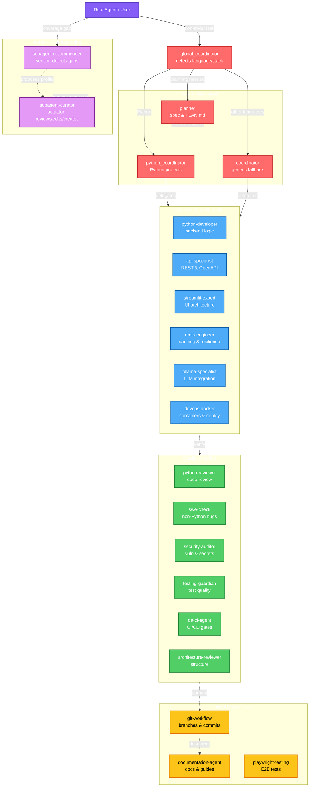
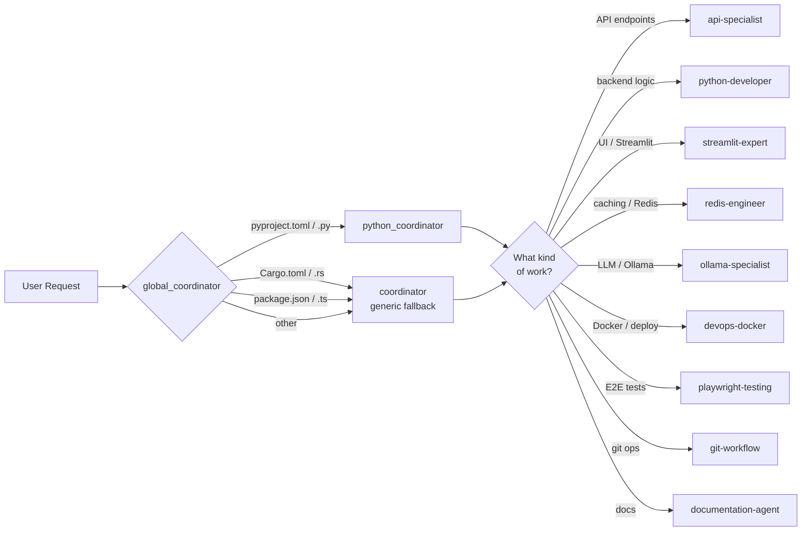
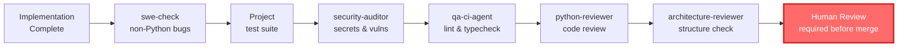
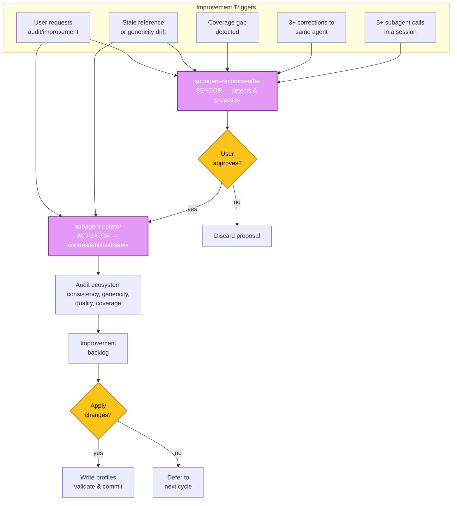

# Devin Multi-Agent Architecture

## Ecosystem Overview



The plugin provides 22 subagent profiles and 29 skills, organized into coordinators, implementation specialists, quality reviewers, workflow agents, and process skills.

## Delegation Flow



## Verification Pipeline



## Continuous Improvement Loop



## Agent Inventory

> **Model inheritance:** Agent profiles do **not** pin a `model:` field by
> default. All agents inherit the **default subagent model**, which admins can
> configure centrally via org/enterprise settings. To override the default for
> a specific agent, add a `model:` line to that agent's `AGENT.md` frontmatter.
> Valid values include: `swe`, `opus`, `sonnet`, `haiku`, `codex`, `gemini`,
> `gpt`.

| Category | Agent | Model | Focus |
|----------|-------|-------|-------|
| **Coordinators** | `global_coordinator` | default (inherited) | Detects language/stack, delegates |
| | `coordinator` | default (inherited) | Generic orchestrator |
| | `python_coordinator` | default (inherited) | Python-specific orchestrator |
| | `planner` | default (inherited) | Spec/PLAN.md production (no implementation) |
| **Implementation** | `python-developer` | default (inherited) | FastAPI/Flask/Django backend |
| | `api-specialist` | default (inherited) | REST endpoints, validation, OpenAPI |
| | `streamlit-expert` | default (inherited) | Streamlit UI, caching, reruns |
| | `redis-engineer` | default (inherited) | Redis caching, serialization, fallback |
| | `ollama-specialist` | default (inherited) | Ollama LLM, streaming, structured output |
| | `devops-docker` | default (inherited) | Docker Compose, deployment, health |
| **Quality** | `python-reviewer` | default (inherited) | Python code review (bugs, style, types) |
| | `swe-check` | default (inherited) | Non-Python bug detection |
| | `security-auditor` | default (inherited) | Vulnerabilities, secret detection |
| | `testing-guardian` | default (inherited) | Test coverage, quality, mocking |
| | `qa-ci-agent` | default (inherited) | CI/CD gates, lint, typecheck |
| | `architecture-reviewer` | default (inherited) | Module boundaries, dependency graph |
| | `best-practices-reviewer` | default (inherited) | Cross-language code quality |
| | `feature-verifier` | default (inherited) | Verify features match spec |
| **Workflow** | `git-workflow` | default (inherited) | Branch management, commits, merges |
| | `documentation-agent` | default (inherited) | README, API docs, migration guides |
| | `playwright-testing` | default (inherited) | E2E test creation and maintenance |
| **Meta** | `subagent-curator` | default (inherited) | Reviews/edits/creates agent profiles |

## Skill Inventory

| Category | Skill | Slash Command | Description |
|----------|-------|---------------|-------------|
| **Coordinator** | `coordinator` | `/devin-agents:coordinator` | Pure orchestration |
| **Implementation** | `python-developer` | `/devin-agents:python-developer` | Python backend |
| | `api-specialist` | `/devin-agents:api-specialist` | API design |
| | `streamlit-expert` | `/devin-agents:streamlit-expert` | Streamlit UI |
| | `redis-engineer` | `/devin-agents:redis-engineer` | Redis caching |
| | `ollama-specialist` | `/devin-agents:ollama-specialist` | Ollama integration |
| | `devops-docker` | `/devin-agents:devops-docker` | Docker/DevOps |
| **Quality** | `python-reviewer` | `/devin-agents:python-reviewer` | Python review |
| | `architecture-reviewer` | `/devin-agents:architecture-reviewer` | Architecture review |
| | `security-auditor` | `/devin-agents:security-auditor` | Security audit |
| | `testing-guardian` | `/devin-agents:testing-guardian` | Test quality |
| | `qa-ci-agent` | `/devin-agents:qa-ci-agent` | CI/CD gates |
| | `swe-check` | `/devin-agents:swe-check` | Non-Python bugs |
| | `best-practices-reviewer` | `/devin-agents:best-practices-reviewer` | Cross-language quality |
| | `feature-verifier` | `/devin-agents:feature-verifier` | Verify features match spec |
| **Workflow** | `git-workflow` | `/devin-agents:git-workflow` | Git operations |
| | `documentation-agent` | `/devin-agents:documentation-agent` | Documentation |
| | `playwright-testing` | `/devin-agents:playwright-testing` | Playwright tests |
| **Audits** | `ollama-testing` | `/devin-agents:ollama-testing` | Ollama safety audit |
| | `redis-resilience` | `/devin-agents:redis-resilience` | Redis resilience audit |
| | `quick-review` | `/devin-agents:quick-review` | Quick pre-commit review |
| **Meta** | `subagent-recommender` | `/devin-agents:subagent-recommender` | Detect gaps, propose agents |
| | `subagent-curator` | `/devin-agents:subagent-curator` | Review/edit/create/audit profiles |
| **Process** | `grilling` | `/devin-agents:grilling` | Pre-implementation interview |
| | `tdd` | `/devin-agents:tdd` | Red-green-refactor discipline |
| | `diagnosing-bugs` | `/devin-agents:diagnosing-bugs` | 6-phase debugging |
| | `code-review` | `/devin-agents:code-review` | Two-axis review (standards + spec) |
| | `codebase-design` | `/devin-agents:codebase-design` | Deep module design vocabulary |
| | `handoff` | `/devin-agents:handoff` | Session continuity |

## Workflow Patterns

### API Development
```
global_coordinator → python_coordinator → api-specialist (design)
  → python-reviewer (review) → testing-guardian (validate)
  → security-auditor (scan) → qa-ci-agent (gates) → git-workflow (commit)
```

### UI Development
```
global_coordinator → python_coordinator → streamlit-expert (UI)
  → python-reviewer (review) → testing-guardian (validate)
  → security-auditor (scan) → coordinator (synthesize)
```

### Infrastructure Setup
```
global_coordinator → coordinator → devops-docker (containers)
  → security-auditor (scan) → coordinator (synthesize)
```

### Git Workflow
```
coordinator → git-workflow (branch/commit)
  → python-reviewer (code review) → security-auditor (secrets check)
  → git-workflow (merge) → coordinator (synthesize)
```

### New Agent Creation (Improvement Loop)
```
repeated unscoped work → subagent-recommender (propose)
  → user approves → subagent-curator (create & validate)
  → profile available next session
```

## Key Design Principles

1. **Single Responsibility** — Each agent has a clear, focused domain
2. **Hierarchical Delegation** — Coordinators break down tasks, specialists execute
3. **Parallel Execution** — Independent subtasks run concurrently
4. **Cross-Validation** — Code reviewed by multiple specialists (security, testing, review)
5. **Safe Operations** — Git and destructive operations have limited permissions
6. **Minimum Access** — Each agent gets only the tools it needs
7. **Generic by Default** — Plugin profiles are project-agnostic; customization is local
8. **Self-Improving** — The recommender/curator loop keeps the ecosystem evolving
